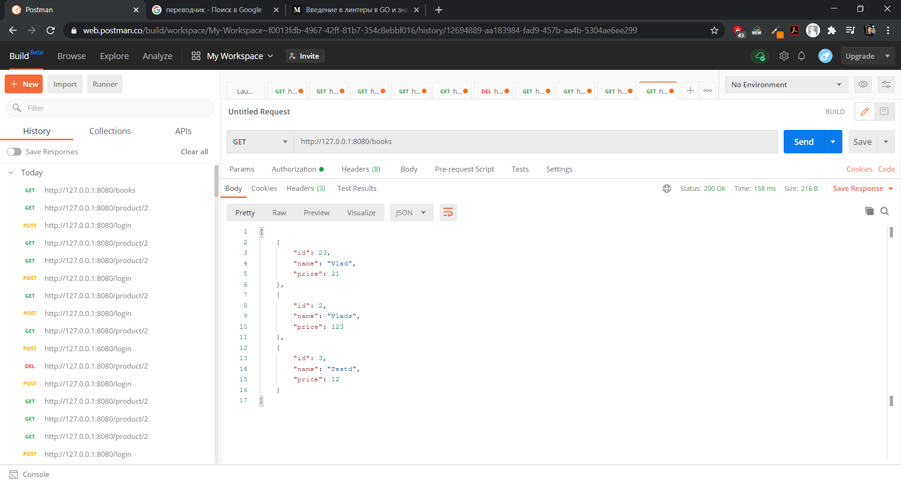

# Rest-API
- gorilla/mux for routing

- lib/pq PostgreSQL driver for database

- dgrijalva/jwt-go for authorization

- badoux/checkmail for checkmail valid

- golangci/golangci-lint for testing

# CRUD of Books
- create a new book: POST to /book

- delete an existing book: DELETE to /book/{id}

- update an existing book: PUT to /book/{id}

- fetch an existing book: GET to /book/{id}

- fetch a list of all existing books: GET to /books



## Authorization with JWT

- Authorization user: POST to /login

## Linter
For testing Linter

```
golangci-lint run 
```

## Tests for the API
For testing API

```
go test -v
```

## Docker and Docker-compose


