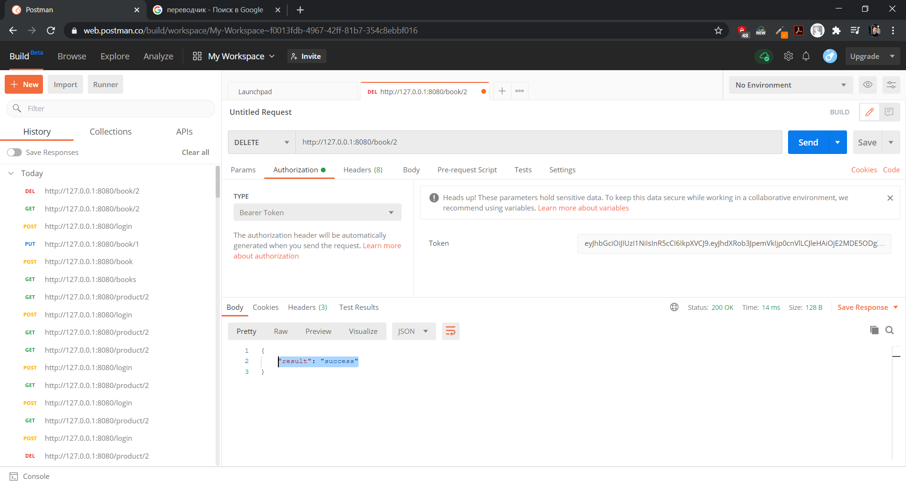
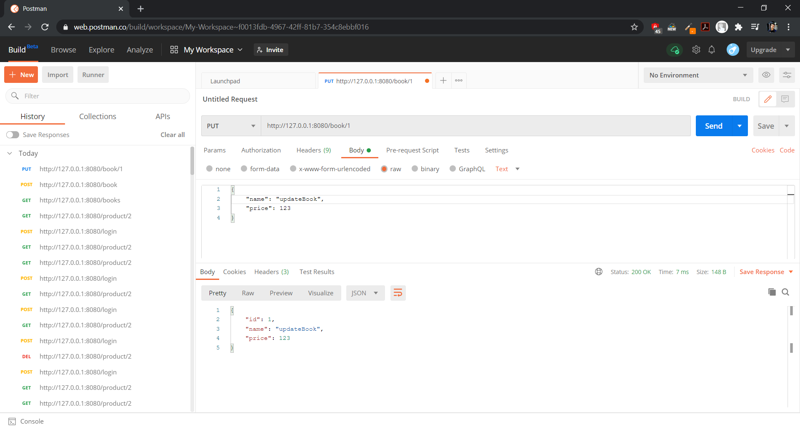
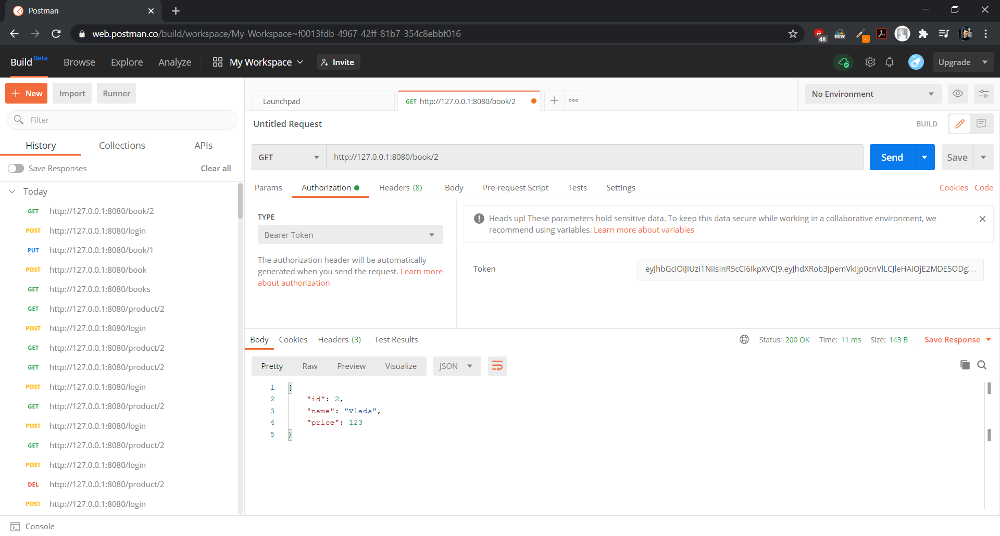
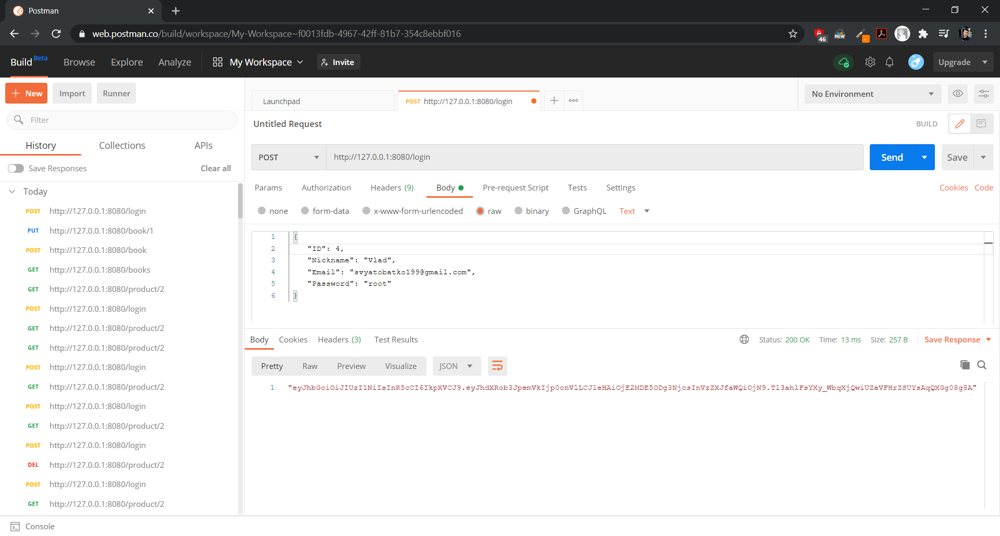
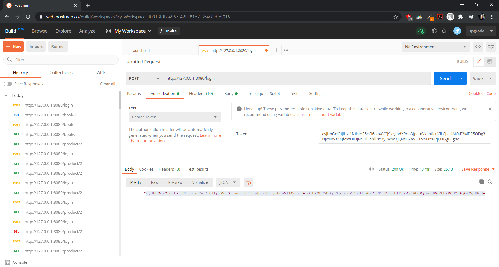
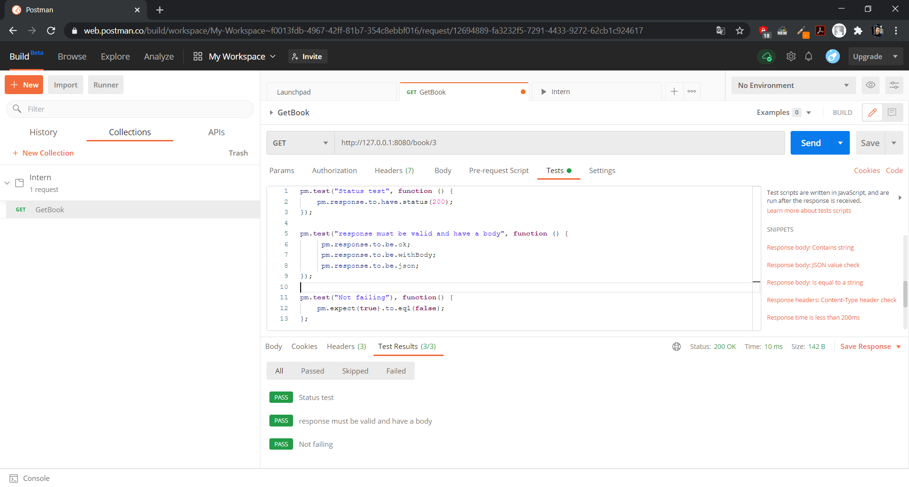

# Rest-API
- gorilla/mux for routing

- lib/pq PostgreSQL driver for database

- dgrijalva/jwt-go for authorization

- badoux/checkmail for checkmail valid

- golangci/golangci-lint for testing

# CRUD of Books
- create a new book: POST to /book


- delete an existing book: DELETE to /book/{id}



- update an existing book: PUT to /book/{id}



- fetch an existing book: GET to /book/{id}



- fetch a list of all existing books: GET to /books


## Authorization with JWT

- Authorization user: POST to /login

   - Authorization get Token

   

   - Authorization set Token

   


## Linter
For testing Linter

```
golangci-lint run 
```

## Tests for the API
For testing API

```
go test -v
```

## Automated testing with Postman

 
```
pm.test("Status test", function () {
    pm.response.to.have.status(200);
});

pm.test("response must be valid and have a body", function () {
     pm.response.to.be.ok;
     pm.response.to.be.withBody;
     pm.response.to.be.json;
});

pm.test("Not failing"), function() {
    pm.expect(true).to.eql(false);
};
```



## Docker 

Docker builds and runs the application but not the database ((

```
docker build -t main .

docker run --name main -d --rm -p 8080:8080 main
```

## Docker-compose

Docker-copmpose builds and runs the application but not the database ((

```
docker-compose up -d
```


